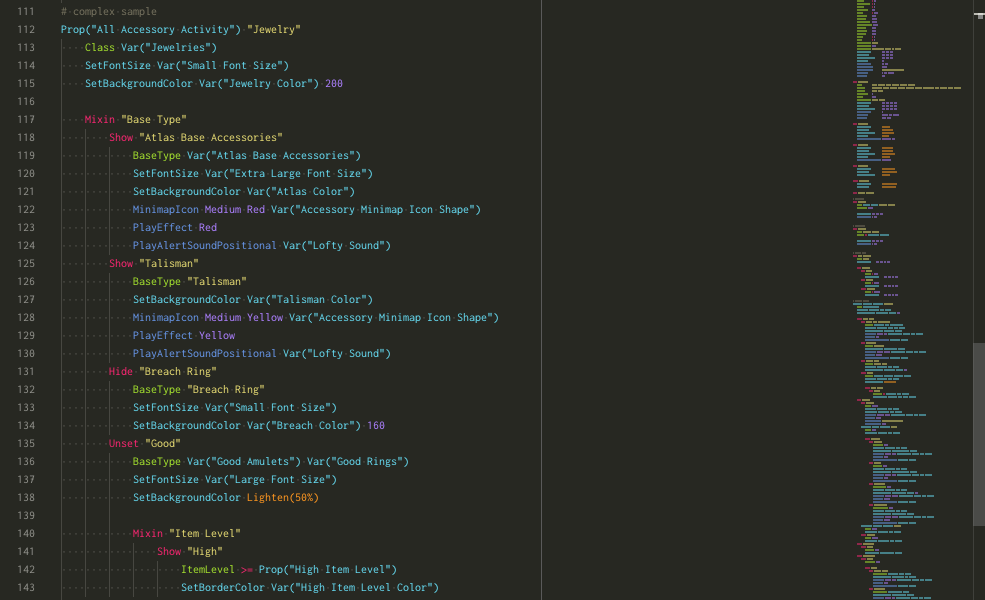
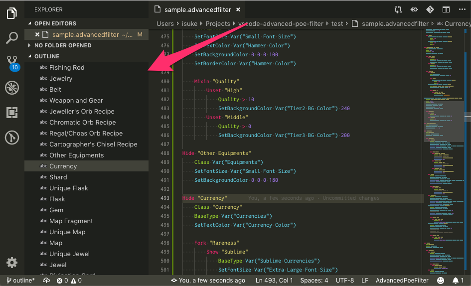

# Advanced PoE Filter [VS Code](https://code.visualstudio.com/) Extenstion

[](https://raw.githubusercontent.com/isuke/vscode-advanced-poe-filter/master/LICENSE) [](https://github.com/isuke/git-consistent)

This [VS Code](https://code.visualstudio.com/) extension provides support for Advanced PoE Filter.

Advanced PoE Filter is used by [Filter of Kalarandra](https://filter-of-kalandra.netlify.com/).

## Features

### Syntax Highlighting



### Outline



### Snippets

- Show Block
- Hide Block
- Unset Block
- Fork Branch
- Mixin Branch
- Var Macro
- Prop Macro

## Recommended Setting

Add the following to your `setting.json`.

```json
  "[advancedpoefilter]": {
    "editor.tabSize": 4,
  },
  "editor.tokenColorCustomizations": {
    "textMateRules": [
      {
        "scope": "keyword.other.macro.advancedpoefilter",
        "settings": { "fontStyle": "underline" }
      },
      {
        "scope": "keyword.other.function.advancedpoefilter",
        "settings": { "fontStyle": "underline" }
      },
      {
        "scope": "keyword.control.activity.advancedpoefilter",
        "settings": { "foreground": "#6699cc" }
      },
      {
        "scope": "keyword.control.condition.advancedpoefilter",
        "settings": { "foreground": "#66cccc" }
      },
      {
        "scope": "keyword.control.action.text.advancedpoefilter",
        "settings": { "foreground": "#cc99cc" }
      },
      {
        "scope": "keyword.control.action.effect.advancedpoefilter",
        "settings": { "foreground": "#ffcc66" }
      }
    ]
  },
```
